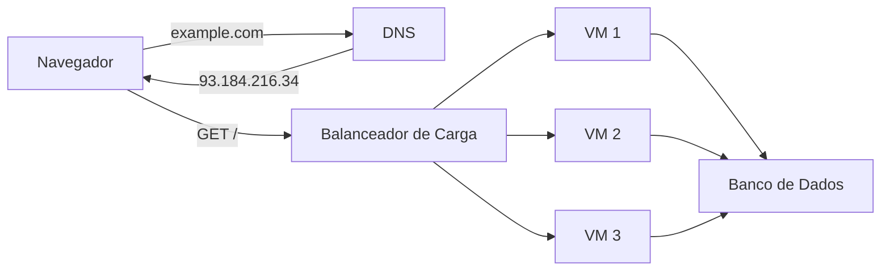
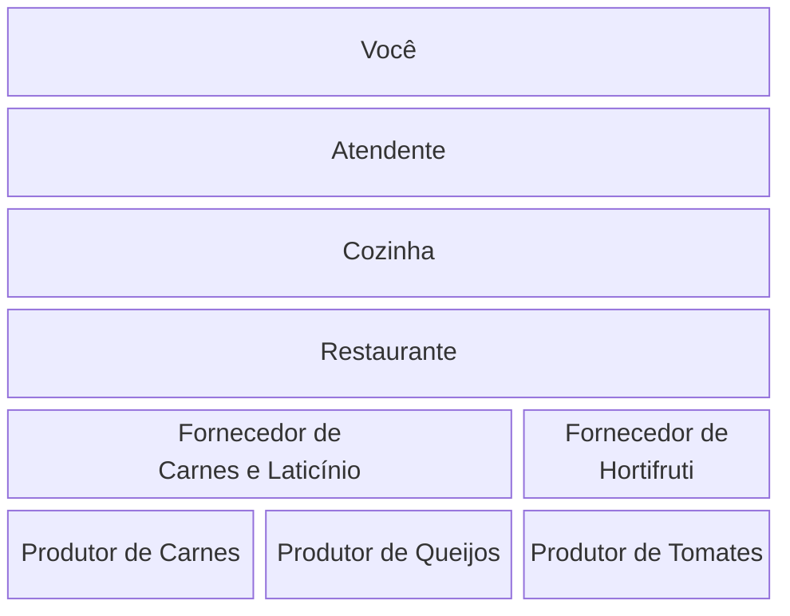
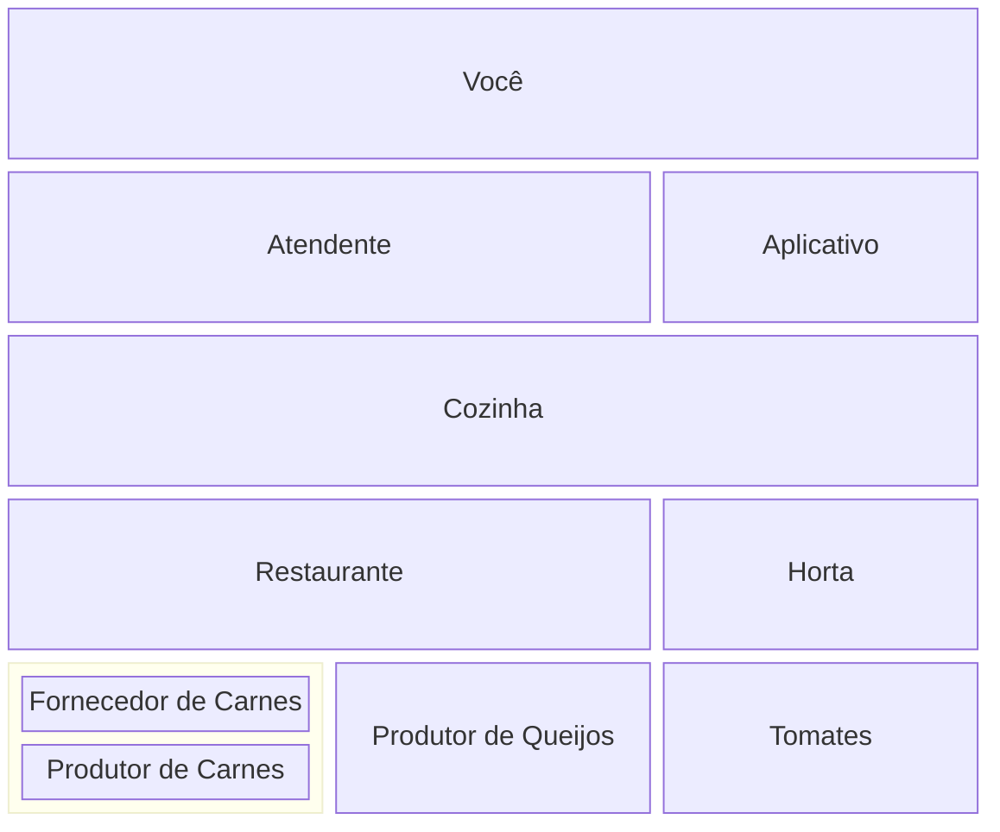
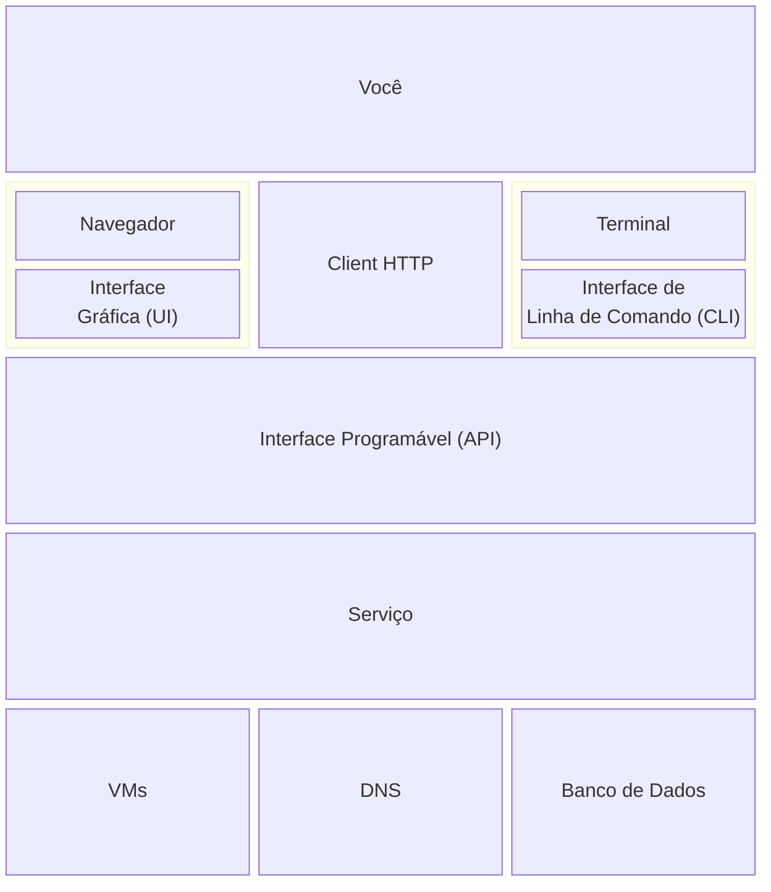
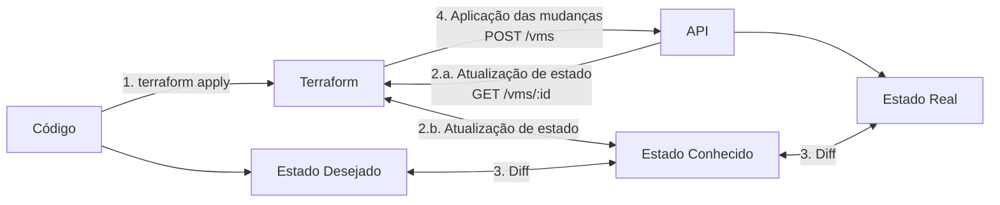

[Terraform](https://www.terraform.io/) é uma ferramenta bastante utilizada no
mundo DevOps. Eu comecei a usar por volta de 2015/16, na versão 0.6 ou 0.7 e,
nessa época, ainda era uma ferramenta em desenvolvimento e pouco conhecida. Como
não existia muito material disponível sobre o assunto, e eu acabei aprendendo a
usar do meu jeito.

Com o tempo, eu percebi que algumas coisas que eu fazia e a forma como pensava
sobre Terraform era um pouco diferente das outras pessoas. Eu acho que parte
disso vem da minha experiência como desenvolvedor de software, e também um pouco
de liberdade criativa para criar soluções antes da ferramenta se popularizar e
padrões emergirem.

Tem muito assunto para cobrir, e não vai dar para tocar em tudo nesse post,
então eu vou começar explicando o que é o Terraform para criar uma intuição de
como ele funciona. Em posts futuros eu vou expandir em partes mais específicas.

## O que é Terraform?

Terraform é uma ferramenta que permite definir e gerenciar infraestrutura usando
código, e por isso é categorizado como uma ferramenta de
infraestrutura-como-código (_infrastructure-as-code_, ou _IaC_ em inglês).

A princípio, essa definição é um pouco vaga. Por que criar infraestrutura com
código? Isso não é o que um script faz? Vamos navegar por um exemplo para
responder essas e muitas outras perguntas.

Nosso cenário é subir uma infraestrutura na nuvem para uma aplicação web. Esse
sistema precisa dos seguintes componentes:

> ***Nota:*** Não se preocupe em entender cada componente. A ideia principal é
  que um sistema moderno é composto por diversas partes que precisam ser criadas
  e configuradas para que tudo funcione como esperado.

* Três máquinas virtuais (_virtual machines_, _VMs_) para rodar a aplicação.
* Uma instância de banco de dados para persistir informações.
* Um balanceador de carga para distribuir requisições entre as VMs da
  aplicação.
* Uma entrada de [DNS (_Domain Name
  System_)](https://pt.wikipedia.org/wiki/Sistema_de_Nomes_de_Dom%C3%ADnio)
  apontando para resolver o nosso domínio para o balanceador de carga.



A forma mais direta de criar esses recursos é através da interface web do
provedor de serviço de nuvem que você usa, como o Amazon Web Server (AWS),
Microsoft Azure, Google Cloud Platform (GCP) etc.

Alguns cliques aqui e ali, uns 5 ou 6 formulários preenchidos e temos a nossa
infraestrutura rodando!

Mas agora precisamos escalar essa infraestrutura. Ao invés de três VMs vamos
precisar de dez. Essas VMs também terão papéis diferentes, então duas delas
podem ser menores do que as outras.

Apesar de cada mudança ser relativamente fácil de fazer pelo painel web, a soma
de todas as mudanças necessárias se torna um desafio pois o processo é manual,
lento e suscetível a erros. Um formulário preenchido com uma letra errada e a
nossa aplicação pode parar de funcionar.

## APIs

Uma alternativa é automatizar esse processo. Serviços hospedados na nuvem
costumam providenciar uma interface especialmente focada em ser acessada por
máquinas e de forma programável. Essa interface é chamada de interface de
programação de aplicações (_Application Programming Interface_), ou _API_.

Quebrando a definição de API em partes, vamos começar com **interface**.

Uma interface é uma camada situada entre dois meios. Ao colocar água e óleo em
um copo é possível ver uma linha separando as duas partes, essa é a _interface
água-óleo_. Em um copo só com água é possível ver uma linha no topo, que é a
_interface água-ar_.

Em um restaurante, a pessoa que está nos atendendo é a interface entre nós e a
cozinha, e esse exemplo ilustra um papel valioso de uma interface: ela permite
_abstrair, traduzir, reduzir e simplificar interações_.

Nós não precisamos descrever que queremos um pedaço de carne cortada em bife,
frito em uma frigideira e coberta com queijo e molho de tomate, basta pedirmos
um filé a parmegiana.

A complexidade envolvida em preparar esse prato está escondida na cozinha. A
complexidade de adquirir os ingredientes está escondida na administração do
restaurante. A complexidade de plantar o tomate, criar vacas e produzir queijo
estão todas escondidas nos produtores de comida.

Cada etapa possui uma _interface_ que permite que os componentes acima não
precisem conhecer os detalhes que estão abaixo. Nós fazemos um pedido usando um
cardápio, não com uma lista de ingredientes e uma receita. A cozinha envia uma
lista de compras para a administração ao invés de criar vacas e plantar tomates
no fundo do restaurante.



Podemos então dizer que, de certa forma, o cardápio _abstrai_ o preparo de
comida, e a lista de compras enviada para a administração do restaurante
_abstrai_ a busca, compra e produção de alimentos.

***Tagente: vamos desviar um pouco o curso para falar sobre abstrações.***

Abstrações às vezes são vistas como uma forma de _esconder_ detalhes, mas essa é
uma visão um pouco equivocada. O cientista da computação [Edsger
Dijkstra](https://pt.wikipedia.org/wiki/Edsger_Dijkstra) as descreveu como:

> _O objetivo de uma abstração não é ser vaga, mas criar um novo nível semântico
  onde é possível ser absolutamente preciso._

Um bife a parmegiana existe em um nível acima da carne, do queijo, tomate,
frigideira etc. É uma descrição _precisa_ do que queremos. Mesmo que ela não
exista até que seja preparada, uma pessoa entende _exatamente_ o que queremos
quando pedimos uma em um restaurante.

***Fim da tangente.***

Um outro ponto importante é que cada camada pode ter mais de uma interface.

Por exemplo, nós podemos pedir comida através de um aplicativo ao invés de ir em
pessoa. Um restaurante pode comprar produtos diretamente de produtores locais,
ou a cozinha pode até criar uma horta própria para ter acesso direto a
ingredientes.



Voltando para o mundo da computação, uma interface conecta um componente da
arquitetura a outro. Esses componentes podem ser uma máquina, uma ferramenta, um
código ou até mesmo uma pessoa.

Ao acessar um site nós interagimos com um navegador, que é a interface entre nós
e a Internet. O site retorna código em HTML que o seu navegador traduz em
elementos visuais, criando uma interface visual e interativa que é simples de
ser consumida por pessoas.

Essa interface é conhecida como **interface de usuário** (_user interface_), ou
_UI_. Na seção anterior, nós utilizamos uma _UI_ -- o painel do provedor de
nuvem -- para criar a nossa infraestrutura.

Como o foco de uma UI é de ser acessado por uma pessoa, o formato e tipos de
dados retornados por estas interfaces não são tão fáceis de serem processados em
código.

Uma pessoa consegue encontrar o nome de uma VM em uma tabela sem maiores
problemas, mas um programa talvez precise analisar diversas camadas de código
para encontrar o mesmo valor.

Camadas que podem ser alteradas a qualquer momento. Mudar a cor de fundo de uma
tabela é uma alteração que pessoas conseguem se adaptar facilmente, mas que pode
quebrar um código implementado de forma rígida e que dependa de um valor
específico para essa cor.

Então precisamos um tipo diferente de interface para criar automações
resilientes, que é justamente onde as outras partes do nome API se encaixam:
interface de **programação de aplicações**.

Ao invés de retornar dados de forma visual e interativa, uma API utiliza
formatos que são mais fáceis de serem processados por máquinas, como
[JSON](https://pt.wikipedia.org/wiki/JSON) e
[XML](https://pt.wikipedia.org/wiki/XML). Ao invés de navegar pela interface
através de cliques, uma API define uma estrutura rígida e previsível de como
encontrar e requisitar informações, como os padrões
[REST](https://pt.wikipedia.org/wiki/REST) e
[SOAP](https://pt.wikipedia.org/wiki/SOAP).

O processo para encontrar o IP de uma VM usando a UI do painel web do serviço de
nuvem é mais ou menos assim.

1. Acessar a página de login do serviço de nuvem.
1. Preencher e enviar o formulário de login.
1. Acessar o serviço de VMs.
1. Encontrar a VM desejada na tabela de VMs.
1. Acessar os detalhes da VM.
1. Encontrar o IP da VM.

O mesmo processo usando uma API REST pode ser descrito dessa forma:

1. Realizar uma requisição HTTP `GET /vms` com um token de autenticação.
1. Extrair o ID da VM desejada do documento JSON retornado.
1. Realizar uma requisição HTTP `GET /vms/:id` com um token de autenticação.
1. Extrair o IP da VM do JSON retornado.

Apesar de serem parecidos, a segunda opção é muito mais mecânica, estável e
estruturada e, portanto, mais fácil de automatizar.

A UI pode ser alterar a qualquer momento, mudando o formato da tabela, a posição
do botão de login, a ordem de navegação entre páginas etc. e, como vimos, essas
mudança  inesperada podem quebrar um script.

Em contrapartida, APIs costumam ter garantias de estabilidade contra mudanças,
com alguns provedores inclusive suportando múltiplas versões para evitar
surpresas.

Por serem programáveis, é comum que APIs sejam a camada base para outras
interfaces.

Por exemplo, uma outra interface bastante utilizada é a **interface de linha de comando** (_command line interface_), a famosa _CLI_ que nos permite interagir
com um serviço através de comandos em um terminal.

Por debaixo dos panos, essa CLI pode estar fazendo requisições para uma API, e o
mesmo pode ser feito com uma UI.



***Mas o que que tudo isso tem a ver com Terraform?***

Boa pergunta!

Vamos voltar ao nosso cenário da criação da infraestrutura da nossa aplicação, só que dessa vez não iremos utilizar a interface gráfica (UI) mas sim criar um script para automatizar o processo utilizando a CLI do nosso serviço de nuvem e, por consequência, a API.

## Automação através de scripts

Vamos escrever um script para criar a nossa infraestrutura inicial.

> ***Nota:*** os códigos dessa sessão são uma representação de uma linguagem de
  script shell, como `bash`, mas não são exatamente corretos. O mais importante
  é entender a lógica, não exatamente a sintaxe utilizada.

```
cloud vm create --cpu=4 --memory=8 --name=vm-1
cloud vm create --cpu=4 --memory=8 --name=vm-2
cloud vm create --cpu=4 --memory=8 --name=vm-3
cloud db create
lb=$(cloud lb create --format=json)
cloud dns create-record --type=A --name=example.com --value=$(lb | jq '.ip')
```

Como estamos escrevendo código, podemos começar a aproveitar as vantagens que
uma linguagem de programação providencia. Por exemplo, podemos criar as três VMs
em um [laço
(_loop_)](https://pt.wikipedia.org/wiki/Loop_(programa%C3%A7%C3%A3o)).

```
for i in {1..3}; do
  cloud vm create --cpu=4 --memory=8 --name="vm-$i"
done
cloud db create
lb=$(cloud lb create --format=json)
cloud dns create-record --type=A --name=example.com --value=$(lb | jq '.ip')
```

Agora, se precisarmos escalar a nossa infraestrutura para 10 máquinas, podemos
apenas atualizar o _loop_ ao invés de repetir a operação manualmente.

```diff
+ for i in {1..10}; do
    cloud vm create --cpu=4 --memory=8 --name="vm-$i"
+ done
  cloud db create
  lb=$(cloud lb create --format=json)
  cloud dns create-record --type=A --name=example.com --value=$(lb | jq '.ip')
```

Se as duas primeiras VMs precisarem ser de tamanhos diferentes, podemos usar [condicionais](https://pt.wikipedia.org/wiki/Estrutura_de_sele%C3%A7%C3%A3o).

```diff
for i in {1..10}; do
+ if [ $i -le 2 ]; then
+   cloud vm create --cpu=2 --memory=4 --name="vm-$i"
+ else
    cloud vm create --cpu=4 --memory=8 --name="vm-$i"
+ fi
done

cloud db create
lb=$(cloud lb create --format=json)
cloud dns create-record --type=A --name=example.com --value=$(lb | jq '.ip')
```

Além de automação e lógica, criar a nossa infraestrutura com código permite o
uso de diversas práticas e conceitos do mundo da programação:

* Podemos **copiar-e-colar um servidor** simplesmente copiando-e-colando o
  código que o cria.
* Em uma escala maior, é possível **criar, destruir, recriar e copiar ambientes
  inteiros** apenas manipulando arquivos de texto.
* Podemos **abstrair e reutilizar** operações. Se uma certa ação é realizada com
  frequência, é possível descrevê-la em algo como uma
  [função](https://pt.wikipedia.org/wiki/M%C3%A9todo_(programa%C3%A7%C3%A3o)) e
  chamá-la diversas vezes com uma linha só.

Apesar do benefícios, escrever código também adiciona uma série de desafios.

### Quando a automação dá errado

Um processo automatizado, sem intervenção humana, exige cuidados extras na hora
de tratar erros.

Usando a interface gráfica, fica claro se a criação de uma VM falhar. Nós
recebemos uma mensagem de erro na tela e podemos analisar a situação e tomar uma
decisão com base no resultado: tentar a ação novamente, contatar o time de
suporte, ajustar o limite de cotas de recursos do seu projeto etc.

Em um script, essa decisão pode não ser tão fácil de tratar. Ou então esquecemos
completamente de considerar certos erros!

Então agora o nosso script precisa de algo assim:

```diff
  for i in {1..10}; do
    if [ $i -le 2 ]; then
-     cloud vm create --cpu=2 --memory=4 --name="vm-$i"
+     if ! cloud vm create --cpu=2 --memory=4 --name="vm-$i"; then
+       echo "Erro ao criar VM"
+       exit 1
+     fi
    else
-     cloud vm create --cpu=4 --memory=8 --name="vm-$i"
+     if ! cloud vm create --cpu=4 --memory=8 --name="vm-$i"; then
+       echo "Erro ao criar VM"
+       exit 1
+     fi
    fi
  done

- cloud db create
+ if ! cloud db create; then
+   echo "Erro ao criar banco"
+   exit 1
+ fi

- lb=$(cloud lb create --format=json)
+ if ! lb=$(cloud lb create --format=json); then
+   echo "Erro ao criar balanceador de carga"
+   exit 1
+ fi

- cloud dns create-record --type=A --name=example.com --value=$(lb | jq '.ip')
+ if ! cloud dns create-record --type=A --name=example.com --value=$(lb | jq '.ip'); then
+   echo "Erro ao criar entrada de DNS"
+   exit 1
+ fi
```

Hum...as coisas estão começando a ficar mais complicadas. Mas não se preocupe
porque podemos piorar ainda mais.

Sempre que rodarmos esse script, ele vai tentar criar todos os recursos
novamente. Se precisarmos de uma nova entrada de DNS, nós vamos recriar as VMs.
Em termos técnicos, esse script não é **idempotente**.

### Idempotência

Idempotência é uma propriedade que vem da matemática. Uma entidade é considerada
idempotente se, ao ser chamada múltiplas vezes, o resultado final é sempre o
mesmo.

Por exemplo, a função `f(x) = x + 1` (ou seja, uma função que soma 1 ao valor de
entrada `x`) é idempotente. `f(1)` é sempre 2 (`1 + 1 = 2`) e `f(5)` é sempre 6
(`5 + 1 = 6`), não importa quantas vezes executarmos a função.

O comando `echo` reproduz o valor de entrada na saída de um terminal, e é
idempotente pois, executar o comando `echo "Olá mundo"` sempre irá produzir o
mesmo resultado.

Você pode estar pensando que isso não é verdade, pois executar algo como `echo
$(date)` gera uma saída diferente a cada chamada, cada vez com uma data e
horário diferente, dependendo de quando o comando é executado.

Mas note que é a entrada do comando `echo` que está sendo alterada. Fixando uma
data, a saída do comando `echo` será sempre a mesma, então é o comando `date`
que não é idempotente nesse caso.

Voltando ao nosso script de infraestrutura, ele não é idempotente porque a cada
vez que o executarmos teremos uma infraestrutura nova.

Inicialmente, a nossa conta na nuvem não possui nenhum recurso criado. Ao
executar o script pela primeira vez, teremos dez VMs, um banco de dados, um
balanceador de carga e uma entrada de DNS.

Se executarmos o script novamente, teremos o _dobro_ de recursos: 20 VMs, dois
bancos de dados, dois balanceadores de carga e duas entradas de DNS.

Isso se torna um desafio para gerenciar mudanças. Como criar uma entrada nova de
DNS? Se adicionarmos uma linha nova no script e o rodarmos de novo, iremos criar
mais dez VMs!

Então, antes de criar algum recurso, é preciso sempre verificar se ele já
existe.

```diff
for i in {1..10}; do
  if [ $i -le 2 ]; then
+   if cloud vm get "vm-$i"; then
+     echo "VM vm-$i já existe"
+   else
      if ! cloud vm create --cpu=2 --memory=4 --name="vm-$i"; then
        echo "Erro ao criar VM"
        exit 1
      fi
+   fi
  else
    ...
  fi
done
...
```

Isso irá adicionar muitas linhas de código, mas não terminamos ainda.

Na versão atual do script, para apagar um recurso é preciso verificar _o que
não está escrito no código_. Esse ponto é extremamente sutil, mas muito
importante.

Vamos supor que agora precisamos de nove VMs e não dez.

```diff
- for i in {1..10}; do
+ for i in {1..9}; do
    if [ $i -le 2 ]; then
      if cloud vm get "vm-$i"; then
        echo "VM vm-$i já existe"
      else
        if ! cloud vm create --cpu=2 --memory=4 --name="vm-$i"; then
          echo "Erro ao criar VM"
          exit 1
        fi
      fi
    else
      ...
    fi
  done
  ...
```

Mas apenas mudar o intervalo do loop irá simplesmente ignorar a `vm-10` e
deixá-la rodando!

Note que em momento algum o código trata da `vm-10`. Nós sabemos que ela existe
porque sabemos que o script rodou anteriormente com o loop indo até 10, mas o
script em si não sabe disso, é uma informação que não está descrita em código.

Podemos alterar o nosso script para que ele explicitamente apague a `vm-10`,
mas, assim como no caso de criação de recursos, precisamos nos preocupar com
idempotência e tratamento de erros. Se a `vm-10` não existir, o script não deve
fazer nada.

```diff
  for i in {1..9}; do
    ...
  done

+ if cloud vm get vm-10; then
+   if ! cloud vm delete vm-10; then
+     echo "Erro ao apagar VM"
+     exit 1
+   fi
+ fi
...
```

Após a `vm-10` ser apagada, podemos retirar esse trecho de código, mas dá para
notar como esse processo é trabalhoso.

Uma forma mais complexa de resolver esse problema é expandir como o nosso script
trata esse caso. Além de nos preocuparmos com o caso positivo -- o que o script
está fazendo -- podemos também pensar no caso negativo -- o que o script _não
está fazendo_.

Nesse caso, o script _não está criado a `vm-10`_, portanto devemos apagá-la,
mesmo que isso não esteja explicitamente escrito em um comando.

```diff
# Criar VMs.
+ vms_criadas=()
  for i in {1..9}; do
    if [ $i -le 2 ]; then
      if cloud vm get "vm-$i"; then
        echo "VM vm-$i já existe"
      else
        if ! cloud vm create --cpu=2 --memory=4 --name="vm-$i"; then
          echo "Erro ao criar VM"
          exit 1
        fi
+       vms_criadas+=("vm-$i")
      fi
    else
      ...
    fi
  done

# Apagar VMs existentes que não foram criadas pelo script.
+ vms_apagar=()
+ for vm in $(cloud vm list); do
+   existe=false
+   for vm_criada in "${vms_criadas[@]}"; do
+     if [ $vm == $vm_criada ]; then
+       existe=true
+       break
+     fi
+   done
+   if [ $existe -ne "true" ]
+     vms_apagar+=($vm)
+   fi
+  done
+
+ for vm in "${vms_apagar[@]}"; do
+   if ! cloud vm delete $vm; then
+     echo "Erro ao apagar VM"
+     exit 1
+   fi
+ done
...
```

E isso é apenas um pequeno pedaço do script! Quanto mais código for escrito mais
difícil será de mantê-lo e maior será a possibilidade dele conter bugs.

E o código acima já possui um bug grave! Você consegue encontrar? (dica: o que
acontece se rodarmos o script duas vezes seguidas?)

Um script longo também levará mais tempo para executar. No exemplo anterior,
mesmo se não alterarmos as VMs, o código de verificação que lista todas as VMs
da conta irá sempre rodar, adicionando vários segundos ou até minutos
desnecessariamente.

Esse pedaço de script também só consegue tratar um único tipo de recursos (VMs).
Nós vamos precisar escrever a mesma lógica para o banco de dados, o DNS, o
balanceador de carga e qualquer outro serviço que desejarmos utilizar no futuro.

E se precisarmos criar e gerenciar recursos em outros serviços de nuvem? Com uma
CLI e API totalmente diferentes?

Apesar das vantagens da automação por script, podemos ver que ela também possui
diversos desafios.

## Tipos de linguagem de programação

Se voltarmos para o nosso script, podemos notar que ele se comporta como uma
receita de bolo, onde detalhamos exatamente o que fazer e quando.

Computadores, ao contrário de seres humanos, precisam de instruções precisas e
detalhadas do que fazer. Intuitivamente nós sabemos que, se alguém pedir nove
VMs e atualmente existem dez, nós precisamos apagar uma delas. Mas para uma
máquina chegar à mesma conclusão, precisamos escrever diversas linhas de código.

Linguagens de programação desse tipo, onde o programa segue exatamente as linhas
de código na ordem em que foram escritas, são chamadas **linguagens
imperativas**.

Um outro tipo de linguagem de programação são as chamadas **linguagens
declarativas**. Nessas linguagens, o que escrevemos não é o que será executado,
mas sim o que _queremos que aconteça_.

Um exemplo de linguagem declarativa é a
[SQL](https://pt.wikipedia.org/wiki/SQL), utilizada para realizar consultas e
operações em bancos de dados. Se quisermos retornar todas as compras acima de
R$100, podemos escrever uma query em SQL assim.

```sql
SELECT id,valor,data
FROM compras
WHERE valor > 100;
```

Note que em nenhum momento foi preciso definir _como_ encontrar a tabela
`compras`, nem _como_ realizar o _loop_ e filtro dos valores. Apenas declaramos
_o que queremos_ e o banco que se vire em encontrar o resultado.

Um outro exemplo de linguagem declarativa é o
[HTML](https://pt.wikipedia.org/wiki/HTML), utilizado para renderizar páginas
web. O código a seguir renderiza um parágrafo com um título e uma palavra em
negrito:

```html
<h1>Meu Título</h1>
<p>
  Olá <b>mundo</b>!
</p>
```

Em momento algum precisamos interagir com a placa de vídeo, ou procurar as
fontes instaladas no sistema da pessoa acessando o site. Todos esses detalhes
são responsabilidade do seu navegador. Note, novamente, que apenas declaramos _o
que desejamos_ que apareça na tela, o navegador é responsável por implementar
_como_ esse resultado será alcançado.

> ***Nota:*** apesar de ser apresentado como algo binário, na prática linguagens
  de programação podem exibir características imperativas **e** declarativas ao
  mesmo tempo, e também é possível implementar comportamentos declarativos em
  uma linguagem puramente imperativa e vice-versa. Também existem muitos outros
  tipos e paradigmas de linguagens, como orientação a objeto, funcional etc. que
  não foram explicados aqui.

Com esse conhecimento novo podemos pensar que gerenciar a nossa infraestrutura
usando um código declarativo pode ser muito útil. Ao invés de nos preocuparmos
com os detalhes de cada operação poderíamos apenas escrever uma lista _do que
queremos_:

* 2 VMs com 2 cores de CPU e 4GB de memória RAM
* 8 VMs com 4 cores de CPU e 8GB de memória RAM
* 1 banco de dados
* 1 balanceador de carga
* 2 entradas DNS

Essa lista pode ser fornecida a uma ferramenta que irá interpretá-la e terá que
se virar para determinar as chamadas de APIs necessárias para torna-la em
realidade.

Mas mesmo com uma linguagem declarativa nós temos o problema dos casos
negativos: como tratar os elementos que _não_ estão escritos na lista?

Para isso, precisamos de algum tipo de memória. Precisamos lembrar que, em algum
ponto no passado, criamos 10 VMs, e que agora precisamos apagar uma porque
apenas 9 estão declaradas. Esse tipo de "memória" é conhecido como **estado**.

## Estado

O estado descreve as características atuais de alguma coisa. Se eu estiver com
febre, eu posso dizer que o meu estado é _doente_. Quando a febre passar o meu
estado volta a ser _saudável_.

Mas eu também tenho diversos outros parâmetros que descrevem o meu estado: fome,
sono, alegre, sentado, viajando etc. A união de todos esses valores em ponto no
tempo descrevem como eu estou naquele momento.

Similarmente, uma VM também possui um estado. Ela pode estar _ligada_, com _32GB
de RAM_, _4 cores de CPU_, _100GB de disco_, rodando o sistema operacional
_Ubuntu 22.04_. Uma alteração em qualquer um desses valores irá mudar o estado
da VM.

Voltando para a nossa lista declarativa, podemos ver que ela descreve um tipo de
estado. Alterar qualquer valor da lista irá descrever um estado diferente.
Podemos chamar esse estado de **estado desejado**.

Mas esse estado é apenas parte da solução. Existe também um outro estado que
descreve _o que existe de verdade_. Desejar uma VM não significa que ela será
criada. É preciso chamar a API correta para que o serviço de nuvem realmente
crie a VM. Podemos chamar o estado que descreve o que realmente existe no
serviço de nuvem de **estado real**.

Portanto, o nosso desafio é reconciliar a diferença entre o **estado desejado**
e o **estado real**. Precisamos encontrar as diferenças entre eles e executar as
ações necessárias para tornar _o estado desejado em realidade_.

Mas ainda não resolvemos todos os nossos problemas!

Como o estado desejado está descrito na nossa lista, ele é apenas um arquivo de
texto, que pode ser alterado a qualquer momento. Se eu remover uma VM dessa
lista, como podemos saber _qual VM_ foi removida?

Da mesma forma, o estado real pode ser alterado diretamente: uma pessoa pode
entrar no painel web e apagar uma VM, ou usar a CLI para adicionar mais memória
RAM, alterando o estado real da VM sem alterar o estado desejado (a nossa
lista).

Para tratar desses casos, precisamos de um terceiro estado, o **estado
conhecido**.

Toda vez que a ferramenta ler a nossa lista, esse estado conhecido será
atualizado com o resultado do que foi alterado na infraestrutura. Então, se o
estado desejado (lista) ou estado real (infraestrutura existente) mudar, será
possível saber exatamente a diferença desde a última vez que a lista foi lida.

Esses três estados podem ser bem confusos. Vamos rever o nosso cenário de
exemplo usando o que aprendemos sobre linguagem declarativa e estados.

### Criação da infraestrutura inicial

Inicialmente, não temos nada da nossa infraestrutura rodando, temos apenas uma
lista do que queremos criar.

<table style="display: table">
  <thead>
    <tr>
      <th>Estado Desejado</th>
      <th>Estado Conhecido</th>
      <th>Estado Real</th>
    </tr>
  </thead>
  <tbody>
    <tr>
      <td>
        <ul>
          <li><b>vm-1 (4 CPU, 8G RAM)</b></li>
          <li><b>vm-2 (4 CPU, 8G RAM)</b></li>
          <li><b>vm-3 (4 CPU, 8G RAM)</b></li>
          <li><b>db-1</b></li>
          <li><b>lb-1</b></li>
          <li><b>dns-1 (example.com)</b></li>
        </ul>
      </td>
      <td>-</td>
      <td>-</td>
    </tr>
  </tbody>
</table>

Ao rodar a nossa ferramenta, ela vai ler essa lista, comparar com o estado
conhecido e determinar que as seguintes ações precisam ser feitas:

```diff
+ Criar três VMs com 4GHz de CPU e 8GM de RAM.
+ Criar um banco de dados.
+ Criar um balanceador de carga.
+ Criar uma entrada de DNS.
```

Com tudo criado, o nosso estado real agora terá os novos recursos criados.

<table style="display: table">
  <thead>
    <tr>
      <th>Estado Desejado</th>
      <th>Estado Conhecido</th>
      <th>Estado Real</th>
    </tr>
  </thead>
  <tbody>
    <tr>
      <td>
        <ul>
          <li>vm-1 (4 CPU, 8G RAM)</li>
          <li>vm-2 (4 CPU, 8G RAM)</li>
          <li>vm-3 (4 CPU, 8G RAM)</li>
          <li>db-1</li>
          <li>lb-1</li>
          <li>dns-1 (example.com)</li>
        </ul>
      </td>
      <td>-</td>
      <td>
        <ul>
          <li><b>vm-1 (4 CPU, 8G RAM)</b></li>
          <li><b>vm-2 (4 CPU, 8G RAM)</b></li>
          <li><b>vm-3 (4 CPU, 8G RAM)</b></li>
          <li><b>db-1</b></li>
          <li><b>lb-1</b></li>
          <li><b>dns-1 (example.com)</b></li>
        </ul>
      </td>
    </tr>
  </tbody>
</table>

E como esses recursos foram criados usando a nossa ferramente, eles também fazem
parte do estado conhecido.

<table style="display: table">
  <thead>
    <tr>
      <th>Estado Desejado</th>
      <th>Estado Conhecido</th>
      <th>Estado Real</th>
    </tr>
  </thead>
  <tbody>
    <tr>
      <td>
        <ul>
          <li>vm-1 (4 CPU, 8G RAM)</li>
          <li>vm-2 (4 CPU, 8G RAM)</li>
          <li>vm-3 (4 CPU, 8G RAM)</li>
          <li>db-1</li>
          <li>lb-1</li>
          <li>dns-1 (example.com)</li>
        </ul>
      </td>
      <td>
        <ul>
          <li><b>vm-1 (4 CPU, 8G RAM)</b></li>
          <li><b>vm-2 (4 CPU, 8G RAM)</b></li>
          <li><b>vm-3 (4 CPU, 8G RAM)</b></li>
          <li><b>db-1</b></li>
          <li><b>lb-1</b></li>
          <li><b>dns-1 (example.com)</b></li>
        </ul>
      </td>
      <td>
        <ul>
          <li>vm-1 (4 CPU, 8G RAM)</li>
          <li>vm-2 (4 CPU, 8G RAM)</li>
          <li>vm-3 (4 CPU, 8G RAM)</li>
          <li>db-1</li>
          <li>lb-1</li>
          <li>dns-1 (example.com)</li>
        </ul>
      </td>
    </tr>
  </tbody>
</table>

### Escalar infraestrutura

Agora vamos escalar a nossa infraestrutura, atualizando a nossa lista para
termos dez VMs no total, sendo que as duas primeiras serão menores que as
outras.

<table style="display: table">
  <thead>
    <tr>
      <th>Estado Desejado</th>
      <th>Estado Conhecido</th>
      <th>Estado Real</th>
    </tr>
  </thead>
  <tbody>
    <tr>
      <td>
        <ul>
          <li>vm-1 (<b>2 CPU, 4G RAM</b>)</li>
          <li>vm-2 (<b>2 CPU, 4G RAM</b>)</li>
          <li>vm-3 (4 CPU, 8G RAM)</li>
          <li><b>vm-4 (4 CPU, 8G RAM)</b></li>
          <li><b>...</b></li>
          <li><b>vm-9 (4 CPU, 8G RAM)</b></li>
          <li><b>vm-10 (4 CPU, 8G RAM)</b></li>
          <li>db-1</li>
          <li>lb-1</li>
          <li>dns-1 (example.com)</li>
        </ul>
      </td>
      <td>
        <ul>
          <li>vm-1 (4 CPU, 8G RAM)</li>
          <li>vm-2 (4 CPU, 8G RAM)</li>
          <li>vm-3 (4 CPU, 8G RAM)</li>
          <li>db-1</li>
          <li>lb-1</li>
          <li>dns-1 (example.com)</li>
        </ul>
      </td>
      <td>
        <ul>
          <li>vm-1 (4 CPU, 8G RAM)</li>
          <li>vm-2 (4 CPU, 8G RAM)</li>
          <li>vm-3 (4 CPU, 8G RAM)</li>
          <li>db-1</li>
          <li>lb-1</li>
          <li>dns-1 (example.com)</li>
        </ul>
      </td>
    </tr>
  </tbody>
</table>

Ao rodar a nossa ferramenta, ela detecta diferenças entre o nosso estado
desejado e o estado conhecido, e portanto as seguintes ações precisam ser
tomadas para resolver essas diferenças:

```diff
~ Atualizar vm-1 e vm-2 com 2GHz de CPU e 4GB de RAM.
+ Criar sete VMs com 4GHz de CPU e 8GB de RAM.
```

<table style="display: table">
  <thead>
    <tr>
      <th>Estado Desejado</th>
      <th>Estado Conhecido</th>
      <th>Estado Real</th>
    </tr>
  </thead>
  <tbody>
    <tr>
      <td>
        <ul>
          <li>vm-1 (2 CPU, 4G RAM)</li>
          <li>vm-2 (2 CPU, 4G RAM)</li>
          <li>vm-3 (4 CPU, 8G RAM)</li>
          <li>vm-4 (4 CPU, 8G RAM)</li>
          <li>...</li>
          <li>vm-9 (4 CPU, 8G RAM)</li>
          <li>vm-10 (4 CPU, 8G RAM)</li>
          <li>db-1</li>
          <li>lb-1</li>
          <li>dns-1 (example.com)</li>
        </ul>
      </td>
      <td>
        <ul>
          <li>vm-1 (4 CPU, 8G RAM)</li>
          <li>vm-2 (4 CPU, 8G RAM)</li>
          <li>vm-3 (4 CPU, 8G RAM)</li>
          <li>db-1</li>
          <li>lb-1</li>
          <li>dns-1 (example.com)</li>
        </ul>
      </td>
      <td>
        <ul>
          <li>vm-1 (<b>2 CPU, 4G RAM</b>)</li>
          <li>vm-2 (<b>2 CPU, 4G RAM</b>)</li>
          <li>vm-3 (4 CPU, 8G RAM)</li>
          <li><b>vm-4 (4 CPU, 8G RAM)</b></li>
          <li><b>...</b></li>
          <li><b>vm-9 (4 CPU, 8G RAM)</b></li>
          <li><b>vm-10 (4 CPU, 8G RAM)</b></li>
          <li>db-1</li>
          <li>lb-1</li>
          <li>dns-1 (example.com)</li>
        </ul>
      </td>
    </tr>
  </tbody>
</table>

Com as mudanças feitas, podemos atualizar o nosso estado conhecido.

<table style="display: table">
  <thead>
    <tr>
      <th>Estado Desejado</th>
      <th>Estado Conhecido</th>
      <th>Estado Real</th>
    </tr>
  </thead>
  <tbody>
    <tr>
      <td>
        <ul>
          <li>vm-1 (2 CPU, 4G RAM)</li>
          <li>vm-2 (2 CPU, 4G RAM)</li>
          <li>vm-3 (4 CPU, 8G RAM)</li>
          <li>vm-4 (4 CPU, 8G RAM)</li>
          <li>...</li>
          <li>vm-9 (4 CPU, 8G RAM)</li>
          <li>vm-10 (4 CPU, 8G RAM)</li>
          <li>db-1</li>
          <li>lb-1</li>
          <li>dns-1 (example.com)</li>
        </ul>
      </td>
      <td>
        <ul>
          <li>vm-1 (<b>2 CPU, 4G RAM</b>)</li>
          <li>vm-2 (<b>2 CPU, 4G RAM</b>)</li>
          <li>vm-3 (4 CPU, 8G RAM)</li>
          <li><b>vm-4 (4 CPU, 8G RAM)</b></li>
          <li><b>...</b></li>
          <li><b>vm-9 (4 CPU, 8G RAM)</b></li>
          <li><b>vm-10 (4 CPU, 8G RAM)</b></li>
          <li>db-1</li>
          <li>lb-1</li>
          <li>dns-1 (example.com)</li>
        </ul>
      </td>
      <td>
        <ul>
          <li>vm-1 (2 CPU, 4G RAM)</li>
          <li>vm-2 (2 CPU, 4G RAM)</li>
          <li>vm-3 (4 CPU, 8G RAM)</li>
          <li>vm-4 (4 CPU, 8G RAM)</li>
          <li>...</li>
          <li>vm-9 (4 CPU, 8G RAM)</li>
          <li>vm-10 (4 CPU, 8G RAM)</li>
          <li>db-1</li>
          <li>lb-1</li>
          <li>dns-1 (example.com)</li>
        </ul>
      </td>
    </tr>
  </tbody>
</table>

### Reduzir infraestrutura

Agora vamos reduzir a nossa infraestrutura para nove VMs, removendo a `vm-10` da
nossa lista.

<table style="display: table">
  <thead>
    <tr>
      <th>Estado Desejado</th>
      <th>Estado Conhecido</th>
      <th>Estado Real</th>
    </tr>
  </thead>
  <tbody>
    <tr>
      <td>
        <ul>
          <li>vm-1 (2 CPU, 4G RAM)</li>
          <li>vm-2 (2 CPU, 4G RAM)</li>
          <li>vm-3 (4 CPU, 8G RAM)</li>
          <li>vm-4 (4 CPU, 8G RAM)</li>
          <li>...</li>
          <li>vm-9 (4 CPU, 8G RAM)</li>
          <li><b><s>vm-10 (4 CPU, 8G RAM)</s></b></li>
          <li>db-1</li>
          <li>lb-1</li>
          <li>dns-1 (example.com)</li>
        </ul>
      </td>
      <td>
        <ul>
          <li>vm-1 (2 CPU, 4G RAM)</li>
          <li>vm-2 (2 CPU, 4G RAM)</li>
          <li>vm-3 (4 CPU, 8G RAM)</li>
          <li>vm-4 (4 CPU, 8G RAM)</li>
          <li>...</li>
          <li>vm-9 (4 CPU, 8G RAM)</li>
          <li>vm-10 (4 CPU, 8G RAM)</li>
          <li>db-1</li>
          <li>lb-1</li>
          <li>dns-1 (example.com)</li>
        </ul>
      </td>
      <td>
        <ul>
          <li>vm-1 (2 CPU, 4G RAM)</li>
          <li>vm-2 (2 CPU, 4G RAM)</li>
          <li>vm-3 (4 CPU, 8G RAM)</li>
          <li>vm-4 (4 CPU, 8G RAM)</li>
          <li>...</li>
          <li>vm-9 (4 CPU, 8G RAM)</li>
          <li>vm-10 (4 CPU, 8G RAM)</li>
          <li>db-1</li>
          <li>lb-1</li>
          <li>dns-1 (example.com)</li>
        </ul>
      </td>
    </tr>
  </tbody>
</table>

Comparando o estado desejado com o estado conhecido, a nossa ferramenta
determina que a `vm-10` deve ser apagada.

```diff
- Apagar vm-10.
```

<table style="display: table">
  <thead>
    <tr>
      <th>Estado Desejado</th>
      <th>Estado Conhecido</th>
      <th>Estado Real</th>
    </tr>
  </thead>
  <tbody>
    <tr>
      <td>
        <ul>
          <li>vm-1 (2 CPU, 4G RAM)</li>
          <li>vm-2 (2 CPU, 4G RAM)</li>
          <li>vm-3 (4 CPU, 8G RAM)</li>
          <li>vm-4 (4 CPU, 8G RAM)</li>
          <li>...</li>
          <li>vm-9 (4 CPU, 8G RAM)</li>
          <li>db-1</li>
          <li>lb-1</li>
          <li>dns-1 (example.com)</li>
        </ul>
      </td>
      <td>
        <ul>
          <li>vm-1 (2 CPU, 4G RAM)</li>
          <li>vm-2 (2 CPU, 4G RAM)</li>
          <li>vm-3 (4 CPU, 8G RAM)</li>
          <li>vm-4 (4 CPU, 8G RAM)</li>
          <li>...</li>
          <li>vm-9 (4 CPU, 8G RAM)</li>
          <li><b><s>vm-10 (4 CPU, 8G RAM)</s></b></li>
          <li>db-1</li>
          <li>lb-1</li>
          <li>dns-1 (example.com)</li>
        </ul>
      </td>
      <td>
        <ul>
          <li>vm-1 (2 CPU, 4G RAM)</li>
          <li>vm-2 (2 CPU, 4G RAM)</li>
          <li>vm-3 (4 CPU, 8G RAM)</li>
          <li>vm-4 (4 CPU, 8G RAM)</li>
          <li>...</li>
          <li>vm-9 (4 CPU, 8G RAM)</li>
          <li><b><s>vm-10 (4 CPU, 8G RAM)</s></b></li>
          <li>db-1</li>
          <li>lb-1</li>
          <li>dns-1 (example.com)</li>
        </ul>
      </td>
    </tr>
  </tbody>
</table>

### Remoção de recursos fora do código

Agora vamos analisar alguns casos onde o estado real é alterado diretamente.
Isso acontece, por exemplo, quando fazemos mudanças diretamente no painel web ao
invés do código.

No primeiro caso, nós vamos apagar uma VM diretamente pela UI.

<table style="display: table">
  <thead>
    <tr>
      <th>Estado Desejado</th>
      <th>Estado Conhecido</th>
      <th>Estado Real</th>
    </tr>
  </thead>
  <tbody>
    <tr>
      <td>
        <ul>
          <li>vm-1 (2 CPU, 4G RAM)</li>
          <li>vm-2 (2 CPU, 4G RAM)</li>
          <li>vm-3 (4 CPU, 8G RAM)</li>
          <li>vm-4 (4 CPU, 8G RAM)</li>
          <li>...</li>
          <li>vm-9 (4 CPU, 8G RAM)</li>
          <li>db-1</li>
          <li>lb-1</li>
          <li>dns-1 (example.com)</li>
        </ul>
      </td>
      <td>
        <ul>
          <li>vm-1 (2 CPU, 4G RAM)</li>
          <li>vm-2 (2 CPU, 4G RAM)</li>
          <li>vm-3 (4 CPU, 8G RAM)</li>
          <li>vm-4 (4 CPU, 8G RAM)</li>
          <li>...</li>
          <li>vm-9 (4 CPU, 8G RAM)</li>
          <li>db-1</li>
          <li>lb-1</li>
          <li>dns-1 (example.com)</li>
        </ul>
      </td>
      <td>
        <ul>
          <li>vm-1 (2 CPU, 4G RAM)</li>
          <li>vm-2 (2 CPU, 4G RAM)</li>
          <li>vm-3 (4 CPU, 8G RAM)</li>
          <li><b><s>vm-4 (4 CPU, 8G RAM)</s></b></li>
          <li>...</li>
          <li>vm-9 (4 CPU, 8G RAM)</li>
          <li>db-1</li>
          <li>lb-1</li>
          <li>dns-1 (example.com)</li>
        </ul>
      </td>
    </tr>
  </tbody>
</table>

Ao rodar a nossa ferramenta, a primeira ação é atualizar cada recurso conhecido
com base no estado real. Nós pulamos essa etapa nos exemplos anteriores porque
não havia diferença entre esses dois estados, mas nesse cenário essa operação é
importante.

<table style="display: table">
  <thead>
    <tr>
      <th>Estado Desejado</th>
      <th>Estado Conhecido</th>
      <th>Estado Real</th>
    </tr>
  </thead>
  <tbody>
    <tr>
      <td>
        <ul>
          <li>vm-1 (2 CPU, 4G RAM)</li>
          <li>vm-2 (2 CPU, 4G RAM)</li>
          <li>vm-3 (4 CPU, 8G RAM)</li>
          <li>vm-4 (4 CPU, 8G RAM)</li>
          <li>...</li>
          <li>vm-9 (4 CPU, 8G RAM)</li>
          <li>db-1</li>
          <li>lb-1</li>
          <li>dns-1 (example.com)</li>
        </ul>
      </td>
      <td>
        <ul>
          <li>vm-1 (2 CPU, 4G RAM)</li>
          <li>vm-2 (2 CPU, 4G RAM)</li>
          <li>vm-3 (4 CPU, 8G RAM)</li>
          <li><b><s>vm-4 (4 CPU, 8G RAM)</s></b></li>
          <li>...</li>
          <li>vm-9 (4 CPU, 8G RAM)</li>
          <li>db-1</li>
          <li>lb-1</li>
          <li>dns-1 (example.com)</li>
        </ul>
      </td>
      <td>
        <ul>
          <li>vm-1 (2 CPU, 4G RAM)</li>
          <li>vm-2 (2 CPU, 4G RAM)</li>
          <li>vm-3 (4 CPU, 8G RAM)</li>
          <li>...</li>
          <li>vm-9 (4 CPU, 8G RAM)</li>
          <li>db-1</li>
          <li>lb-1</li>
          <li>dns-1 (example.com)</li>
        </ul>
      </td>
    </tr>
  </tbody>
</table>

Agora, para reconciliar o estado desejado com o conhecido, a ação necessária é
recriar a VM que foi removida manualmente.

```diff
+ Criar uma VM com 4GHz de CPU e 8GB de RAM.
```

<table style="display: table">
  <thead>
    <tr>
      <th>Estado Desejado</th>
      <th>Estado Conhecido</th>
      <th>Estado Real</th>
    </tr>
  </thead>
  <tbody>
    <tr>
      <td>
        <ul>
          <li>vm-1 (2 CPU, 4G RAM)</li>
          <li>vm-2 (2 CPU, 4G RAM)</li>
          <li>vm-3 (4 CPU, 8G RAM)</li>
          <li>vm-4 (4 CPU, 8G RAM)</li>
          <li>...</li>
          <li>vm-9 (4 CPU, 8G RAM)</li>
          <li>db-1</li>
          <li>lb-1</li>
          <li>dns-1 (example.com)</li>
        </ul>
      </td>
      <td>
        <ul>
          <li>vm-1 (2 CPU, 4G RAM)</li>
          <li>vm-2 (2 CPU, 4G RAM)</li>
          <li>vm-3 (4 CPU, 8G RAM)</li>
          <li><b>vm-4 (4 CPU, 8G RAM)</b></li>
          <li>...</li>
          <li>vm-9 (4 CPU, 8G RAM)</li>
          <li>db-1</li>
          <li>lb-1</li>
          <li>dns-1 (example.com)</li>
        </ul>
      </td>
      <td>
        <ul>
          <li>vm-1 (2 CPU, 4G RAM)</li>
          <li>vm-2 (2 CPU, 4G RAM)</li>
          <li>vm-3 (4 CPU, 8G RAM)</li>
          <li><b>vm-4 (4 CPU, 8G RAM)</b></li>
          <li>...</li>
          <li>vm-9 (4 CPU, 8G RAM)</li>
          <li>db-1</li>
          <li>lb-1</li>
          <li>dns-1 (example.com)</li>
        </ul>
      </td>
    </tr>
  </tbody>
</table>

### Alteração de recursos fora do código

Vamos agora adicionar mais memória em uma VM diretamente pela UI.

<table style="display: table">
  <thead>
    <tr>
      <th>Estado Desejado</th>
      <th>Estado Conhecido</th>
      <th>Estado Real</th>
    </tr>
  </thead>
  <tbody>
    <tr>
      <td>
        <ul>
          <li>vm-1 (2 CPU, 4G RAM)</li>
          <li>vm-2 (2 CPU, 4G RAM)</li>
          <li>vm-3 (4 CPU, 8G RAM)</li>
          <li>vm-4 (4 CPU, 8G RAM)</li>
          <li>...</li>
          <li>vm-9 (4 CPU, 8G RAM)</li>
          <li>db-1</li>
          <li>lb-1</li>
          <li>dns-1 (example.com)</li>
        </ul>
      </td>
      <td>
        <ul>
          <li>vm-1 (2 CPU, 4G RAM)</li>
          <li>vm-2 (2 CPU, 4G RAM)</li>
          <li>vm-3 (4 CPU, 8G RAM)</li>
          <li>vm-4 (4 CPU, 8G RAM)</li>
          <li>...</li>
          <li>vm-9 (4 CPU, 8G RAM)</li>
          <li>db-1</li>
          <li>lb-1</li>
          <li>dns-1 (example.com)</li>
        </ul>
      </td>
      <td>
        <ul>
          <li>vm-1 (2 CPU, <b>8G RAM</b>)</li>
          <li>vm-2 (2 CPU, 4G RAM)</li>
          <li>vm-3 (4 CPU, 8G RAM)</li>
          <li>vm-4 (4 CPU, 8G RAM)</li>
          <li>...</li>
          <li>vm-9 (4 CPU, 8G RAM)</li>
          <li>db-1</li>
          <li>lb-1</li>
          <li>dns-1 (example.com)</li>
        </ul>
      </td>
    </tr>
  </tbody>
</table>

Ao rodar a nossa ferramenta, ela irá atualizar o estado conhecido dessa VM.

<table style="display: table">
  <thead>
    <tr>
      <th>Estado Desejado</th>
      <th>Estado Conhecido</th>
      <th>Estado Real</th>
    </tr>
  </thead>
  <tbody>
    <tr>
      <td>
        <ul>
          <li>vm-1 (2 CPU, 4G RAM)</li>
          <li>vm-2 (2 CPU, 4G RAM)</li>
          <li>vm-3 (4 CPU, 8G RAM)</li>
          <li>vm-4 (4 CPU, 8G RAM)</li>
          <li>...</li>
          <li>vm-9 (4 CPU, 8G RAM)</li>
          <li>db-1</li>
          <li>lb-1</li>
          <li>dns-1 (example.com)</li>
        </ul>
      </td>
      <td>
        <ul>
          <li>vm-1 (2 CPU, <b>8G RAM</b>)</li>
          <li>vm-2 (2 CPU, 4G RAM)</li>
          <li>vm-3 (4 CPU, 8G RAM)</li>
          <li>vm-4 (4 CPU, 8G RAM)</li>
          <li>...</li>
          <li>vm-9 (4 CPU, 8G RAM)</li>
          <li>db-1</li>
          <li>lb-1</li>
          <li>dns-1 (example.com)</li>
        </ul>
      </td>
      <td>
        <ul>
          <li>vm-1 (2 CPU, 8G RAM)</li>
          <li>vm-2 (2 CPU, 4G RAM)</li>
          <li>vm-3 (4 CPU, 8G RAM)</li>
          <li>vm-4 (4 CPU, 8G RAM)</li>
          <li>...</li>
          <li>vm-9 (4 CPU, 8G RAM)</li>
          <li>db-1</li>
          <li>lb-1</li>
          <li>dns-1 (example.com)</li>
        </ul>
      </td>
    </tr>
  </tbody>
</table>

E, ao comparar o estado desejado com o estado conhecido, a ação necessária para
reconciliar os estados será desfazer a mudança manual.

```diff
~ Atualizar vm-1 para 4GB de RAM.
```

<table style="display: table">
  <thead>
    <tr>
      <th>Estado Desejado</th>
      <th>Estado Conhecido</th>
      <th>Estado Real</th>
    </tr>
  </thead>
  <tbody>
    <tr>
      <td>
        <ul>
          <li>vm-1 (2 CPU, 4G RAM)</li>
          <li>vm-2 (2 CPU, 4G RAM)</li>
          <li>vm-3 (4 CPU, 8G RAM)</li>
          <li>vm-4 (4 CPU, 8G RAM)</li>
          <li>...</li>
          <li>vm-9 (4 CPU, 8G RAM)</li>
          <li>db-1</li>
          <li>lb-1</li>
          <li>dns-1 (example.com)</li>
        </ul>
      </td>
      <td>
        <ul>
          <li>vm-1 (2 CPU, <b>4G RAM</b>)</li>
          <li>vm-2 (2 CPU, 4G RAM)</li>
          <li>vm-3 (4 CPU, 8G RAM)</li>
          <li>vm-4 (4 CPU, 8G RAM)</li>
          <li>...</li>
          <li>vm-9 (4 CPU, 8G RAM)</li>
          <li>db-1</li>
          <li>lb-1</li>
          <li>dns-1 (example.com)</li>
        </ul>
      </td>
      <td>
        <ul>
          <li>vm-1 (2 CPU, <b>4G RAM</b>)</li>
          <li>vm-2 (2 CPU, 4G RAM)</li>
          <li>vm-3 (4 CPU, 8G RAM)</li>
          <li>vm-4 (4 CPU, 8G RAM)</li>
          <li>...</li>
          <li>vm-9 (4 CPU, 8G RAM)</li>
          <li>db-1</li>
          <li>lb-1</li>
          <li>dns-1 (example.com)</li>
        </ul>
      </td>
    </tr>
  </tbody>
</table>

### Adição de recursos fora do código

Agora vamos criar uma VM diretamente pela UI.

<table style="display: table">
  <thead>
    <tr>
      <th>Estado Desejado</th>
      <th>Estado Conhecido</th>
      <th>Estado Real</th>
    </tr>
  </thead>
  <tbody>
    <tr>
      <td>
        <ul>
          <li>vm-1 (2 CPU, 4G RAM)</li>
          <li>vm-2 (2 CPU, 4G RAM)</li>
          <li>vm-3 (4 CPU, 8G RAM)</li>
          <li>vm-4 (4 CPU, 8G RAM)</li>
          <li>...</li>
          <li>vm-9 (4 CPU, 8G RAM)</li>
          <li>db-1</li>
          <li>lb-1</li>
          <li>dns-1 (example.com)</li>
        </ul>
      </td>
      <td>
        <ul>
          <li>vm-1 (2 CPU, 4G RAM)</li>
          <li>vm-2 (2 CPU, 4G RAM)</li>
          <li>vm-3 (4 CPU, 8G RAM)</li>
          <li>vm-4 (4 CPU, 8G RAM)</li>
          <li>...</li>
          <li>vm-9 (4 CPU, 8G RAM)</li>
          <li>db-1</li>
          <li>lb-1</li>
          <li>dns-1 (example.com)</li>
        </ul>
      </td>
      <td>
        <ul>
          <li>vm-1 (2 CPU, 4G RAM)</li>
          <li>vm-2 (2 CPU, 4G RAM)</li>
          <li>vm-3 (4 CPU, 8G RAM)</li>
          <li>vm-4 (4 CPU, 8G RAM)</li>
          <li>...</li>
          <li>vm-9 (4 CPU, 8G RAM)</li>
          <li><b>vm-10 (4 CPU, 8G RAM)</b></li>
          <li>db-1</li>
          <li>lb-1</li>
          <li>dns-1 (example.com)</li>
        </ul>
      </td>
    </tr>
  </tbody>
</table>

Ao rodar a nossa ferramenta...nada acontece! Como essa VM nova não faz parte do
estado conhecido, a nossa ferramenta não sabe da existência dela.

Se quisermos gerenciar essa nova VM com o nosso código, precisamos contar para
a nossa ferramenta que ela existe, ou seja, precisamos adiciona-la ao estado
conhecido.

<table style="display: table">
  <thead>
    <tr>
      <th>Estado Desejado</th>
      <th>Estado Conhecido</th>
      <th>Estado Real</th>
    </tr>
  </thead>
  <tbody>
    <tr>
      <td>
        <ul>
          <li>vm-1 (2 CPU, 4G RAM)</li>
          <li>vm-2 (2 CPU, 4G RAM)</li>
          <li>vm-3 (4 CPU, 8G RAM)</li>
          <li>vm-4 (4 CPU, 8G RAM)</li>
          <li>...</li>
          <li>vm-9 (4 CPU, 8G RAM)</li>
          <li>db-1</li>
          <li>lb-1</li>
          <li>dns-1 (example.com)</li>
        </ul>
      </td>
      <td>
        <ul>
          <li>vm-1 (2 CPU, 4G RAM)</li>
          <li>vm-2 (2 CPU, 4G RAM)</li>
          <li>vm-3 (4 CPU, 8G RAM)</li>
          <li>vm-4 (4 CPU, 8G RAM)</li>
          <li>...</li>
          <li>vm-9 (4 CPU, 8G RAM)</li>
          <li><b>vm-10 (4 CPU, 8G RAM)</b></li>
          <li>db-1</li>
          <li>lb-1</li>
          <li>dns-1 (example.com)</li>
        </ul>
      </td>
      <td>
        <ul>
          <li>vm-1 (2 CPU, 4G RAM)</li>
          <li>vm-2 (2 CPU, 4G RAM)</li>
          <li>vm-3 (4 CPU, 8G RAM)</li>
          <li>vm-4 (4 CPU, 8G RAM)</li>
          <li>...</li>
          <li>vm-9 (4 CPU, 8G RAM)</li>
          <li>vm-10 (4 CPU, 8G RAM)</li>
          <li>db-1</li>
          <li>lb-1</li>
          <li>dns-1 (example.com)</li>
        </ul>
      </td>
    </tr>
  </tbody>
</table>

Agora, ao rodar a nossa ferramenta, a seguinte ação será realizada:

```diff
- Apagar vm-10.
```

Hum...isso pode parecer inesperado, mas aplicando o que aprendemos até agora
podemos entender como a ferramenta chegou nessa decisão.

Ao adicionar a `vm-10` no estado conhecido, nós criamos uma discrepância em
relação ao estado desejado. E, se você comparar os estados acima com o caso de
[Reduzir infraestrutura](#reduzir-infraestrutura), você verá que a diferença é
igual! Portanto a alteração que será feita também é a mesma.

Isso ilustra um ponto importante. Todas as ações realizadas pela nossa
ferramenta são determinadas _apenas_ com base nesses três estados. As ações
individuais que levaram os estados a chegarem nesse ponto, ou a ordem em que
elas foram executadas, não importa.

Nesses últimos exemplos também encontramos um padrão: qualquer alteração
_conhecida_ mas não _desejada_ será desfeita. Por isso dizemos que a nossa lista
-- o nosso código -- é a _fonte da verdade_ para a nossa infraestrutura.

Note também que não existe uma ordenação específica para declarar cada item na
lista. Recursos que não dependem um do outro podem ser criados, editados ou
apagados em paralelo.

Um último ponto -- e talvez o mais importante -- é que, comparando com o nosso
código declarativo, agora é muito mais fácil aplicar mudanças.

Nós só precisamos descrever o que queremos que exista, sem se preocupar com a
lógica de chamadas de API, tratamento de erros, idempotência etc. O programa
responsável por rodar o nosso código irá descobrir e executar o que precisa ser
feito para alcançar o resultado desejado.

## Legal! Mas o que é o Terraform!?

O Terraform é exatamente esse programa!

O estado desejado é descrito usando uma linguagem declarativa chamada [HashiCorp
Configuration Language
(HCL)](https://developer.hashicorp.com/terraform/language/syntax/configuration).
Essa linguagem é estruturada em blocos, e o Terraform define blocos de vários
tipos.

O tipo principal é um recurso
([_resource_](https://developer.hashicorp.com/terraform/language/resources)) que
representa um elemento real: uma VM, uma entrada de DNS ou uma até mesmo uma
[pizza](https://registry.terraform.io/providers/MNThomson/dominos/latest/docs/resources/order).

Cada tipo de bloco possui zero ou mais etiquetas (_labels_). Blocos do tipo
_resource_ possuem dois _labels_: o tipo do recurso e o seu nome, que pode ser
usado para referenciá-lo em outras partes do código.

Cada tipo de _resource_ possui suas próprias configurações que são declaradas
dentro do bloco. Por exemplo, o bloco para uma VM configura o tipo da instância.

O nosso exemplo inicial pode ser descrito em HCL dessa forma usando recursos da
AWS:

```hcl
resource "aws_instance" "vm_1" {
  type = "t3.large"
  # ...
}

resource "aws_instance" "vm_2" {
  type = "t3.large"
  # ...
}

resource "aws_instance" "vm_3" {
  type = "t3.large"
  # ...
}

resource "aws_lb" "lb" {
  # ...
}

resource "aws_db_instance" "db" {
  # ...
}

resource "aws_route53_record" "example_com" {
  name    = "example.com"
  records = [aws_lb.lb.public_ip]
  # ...
}
```

Como ainda estamos trabalhando com uma linguagem de programação, podemos usar
lógica para tornar o nosso código mais dinâmico, como o
[`count`](https://developer.hashicorp.com/terraform/language/meta-arguments/count)
para criar um loop.

```hcl
resource "aws_instance" "vms" {
  count = 3

  type = "t3.large"
  # ...
}

resource "aws_lb" "lb" {
  # ...
}

resource "aws_db_instance" "db" {
  # ...
}

resource "aws_route53_record" "example_com" {
  name    = "example.com"
  records = [aws_lb.lb.public_ip]
  # ...
}
```

Esse código é escrito em arquivos com a extensão `*.tf`. A união de todos esses
arquivos é o nosso **estado desejado**.

O Terraform também possui um arquivo chamado `terraform.tfstate` (conhecido como
[_state file_](https://developer.hashicorp.com/terraform/language/state)) que
armazena o **estado conhecido**.

Esse estado contém informações sobre todos os recursos que foram criados com o
código Terraform da mesma pasta. Toda vez que o Terraform é executado ele
atualiza esse arquivo com as mudanças realizadas. Esse é o estado mais conhecido
quando falamos de Terraform.

Com o binário do Terraform instalado, podemos rodar o comando [`terraform
apply`](https://developer.hashicorp.com/terraform/cli/commands/apply) que irá
executar os seguintes passos:

1. Ler todos os arquivos `*.tf` da pasta atual (estado desejado).
1. Baixar da API (estado real) as informações mais atuais de todos os recursos
  presentes no _state file_ (estado conhecido). Essa ação é chamada de
  atualização de estado (_state refresh_).
1. Comparar e calcular a diferença entre o estado desejado e o conhecido.
1. Realizar as chamadas de API necessárias para alcançar o estado desejado.



Por padrão, entre os passos 3 e 4, o Terraform pausa e apresenta as diferenças
que foram calculadas. O conjunto dessas diferenças é chamado de plano (_plan_) e
detalha todas as mudanças que serão feitas. Em artigos futuros, vamos detalhar
como ler e interpretar esse plano e discutir outros detalhes importantes que ele
contém.

Note como todos os recursos no código de exemplo começam com o prefixo `aws`.
Como a lógica de uma API é totalmente diferente de outra, o Terraform usa
plugins para implementar essas partes específicas do código. Esses plugins são
chamados
[_providers_](https://developer.hashicorp.com/terraform/language/providers) e
você pode encontrá-los no [registro do
Terraform](https://registry.terraform.io/).

Voltando aos problemas encontrados com o nosso script imperativo, o Terraform os
resolve das seguintes maneiras:

* O tratamento de erros é realizado dentro de cada plugin, e é responsabilidade
  de quem implementa o plugin, não de quem usa. Erros só chegam a quem está
  usando o Terraform quando não podem ser resolvidos automaticamente, então, em
  geral, quem está usando o Terraform não precisa escrever código para
  tratá-los.
* Idempotência e remoção de recursos são alcançados mantendo e comparando os
  diferentes estados da infraestrutura.
* Como blocos de recursos podem referenciar uns aos outros, o Terraform sabe
  exatamente a dependência entre eles, podendo criar, atualizar e removê-los o
  mais rápido possível. Os detalhes de como essa ordem é estabelecida também
  será o assunto para um artigo futuro.
* Ao separar a lógica de cada API em plugins, o núcleo do Terraform consegue
  focar na reconciliação e gerenciamento de estado e ser altamente extensível em
  relação a quais APIs são suportadas.

Uma observação importante sobre esse último ponto, e uma fonte comum de confusão
para quem está começando, é que o Terraform **não abstrai serviços de nuvem**.

Por exemplo, não existe uma forma genérica de se criar uma VM na AWS, Azure e
GCP, _cada nuvem possui os seus próprios recursos_. Por isso é importante que,
antes de automatizar uma infraestrutura com Terraform, você conheça bem os
serviços sendo utilizados.

O que o Terraform abstrai é o seu _fluxo de trabalho_.

Ao invés de se preocupar com os detalhes de cada API, CLI e SDK, o Terraforma
permite que você descreva e execute o seu fluxo em uma linguagem comum, com
apenas alguns comandos e independente do serviço sendo utilizado. AWS? GCP?
Azure? Todos podem ser acessados usando HCL e `terraform apply`.

Então o Terraform é, de maneira simplista:

> _Um cliente que sabe chamar diversas APIs e que é capaz de calcular a
  diferença entre o que desejamos criar e o que já existe para tornar uma
  infraestrutura definida em código em realidade._

Essa definição também ajuda a responder uma dúvida frequente sobre o uso do
Terraform: o que o Terraform faz se eu mudar uma configuração de um recurso?
Esse valor é válido ou o Terraform vai gerar um erro?

Na grande maioria dos casos, as respostas para essas perguntas estão na API do
recurso que você está usando.

O que o Terraform faz se eu mudar o tipo de uma
instância EC2 na AWS? Depende do que a API da AWS faz. Esse valor é válido ou o
Terraform vai gerar um erro? Depende se o GCP vai aceitar esse nome.

Por ser -- novamente de forma simplista -- um cliente de diversas APIs, o
comportamento do Terraform vai ser muito próximo ao comportamento da API sendo
chamada diretamente, portanto, além da documentação do Terraform, é importante
ler também a documentação das APIs sendo chamadas.

## Conclusão

Nesse artigo discutimos as motivações e os problemas que o Terraform resolve,
dando uma longa volta para cobrir diversos aspectos do mundo da computação.

Foi um pouco enrolado, mas essa foi a maneira como eu aprendi Terraform, e esse
modo de ver a ferramenta me ajudou a enraizar diversos conceitos e entender
certos comportamentos do Terraform. Espero que tenha sido útil para você também.

Em artigos futuros vamos nos aprofundar mais na parte prática sobre o uso do
Terraform, desde como ele funciona internamente até dicas de como organizar o
seu código.

Se tiverem mais alguma dúvida ou sugestão é só entrar em contato.

Até mais!
